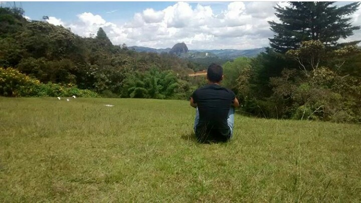

### Hola a todos!

****

**"Don't Lose your way"**

<h3><i class= "ion-ios-pulse-strong" ></i> Bio</h3>

Mi nombre es Julian Esteban Cadavid, desde pequeño tuve gusto por las matemáticas aplicadas, el análisis de datos y la toma de decisiones en las organizaciones.
Me he caracterizado siempre por el esfuerzo y dedicación que le pongo a las cosas, de allí nace la frase "Don't lose your way", siempre tener la mirada puesta más allá del horizonte mientras hago todo lo posible por conseguirlo en el ahora.

<h3><i class="fa fa-graduation-cap fa-lg"></i>  Educación</h3>
- Me gradué del Colegio Madrid Campestre en el año 2016.
- Actualmente estoy en tercer semestre de Estadística en la Universidad Nacional de Colombia, sede Medellín.
